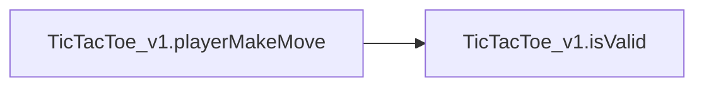
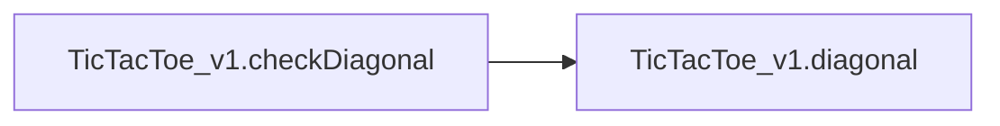
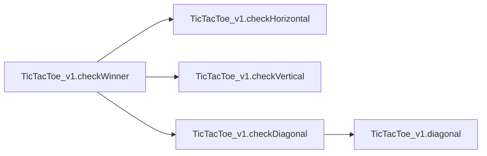
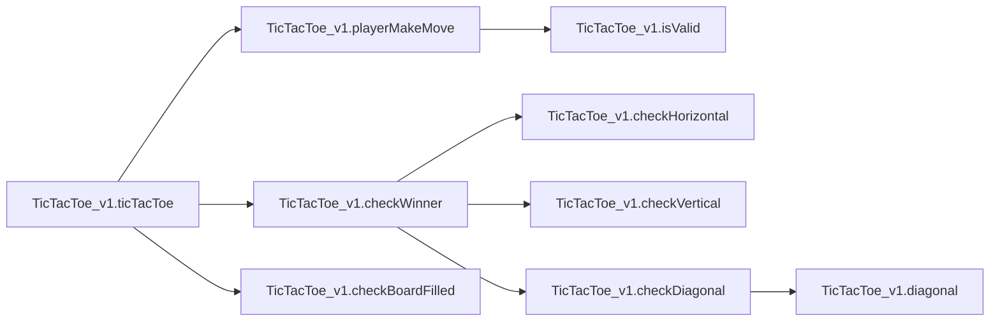

# Detailed Summary

[_Documentation generated by Documatic_](https://www.documatic.com)

<!---Documatic-section-TicTacToe_v1.isValid-start--->
## TicTacToe_v1.isValid

<!---Documatic-section-isValid-start--->
### Summary

Returns True if the given row and column are valid.

<!---Documatic-block-TicTacToe_v1.isValid-start--->
<details>
	<summary><code>TicTacToe_v1.isValid</code> code snippet</summary>

```python
def isValid(row, col):
    if not (row >= 0 and row < 3 and (col >= 0) and (col < 3)):
        return False
    return board[row][col] == ''
```
</details>
<!---Documatic-block-TicTacToe_v1.isValid-end--->
<!---Documatic-section-isValid-end--->
<!---Documatic-section-TicTacToe_v1.isValid-end--->

<!---Documatic-section-TicTacToe_v1.playerMakeMove-start--->
## TicTacToe_v1.playerMakeMove

<!---Documatic-section-playerMakeMove-start--->


### Summary

This function takes a mark and moves it into the board.

### Object Calls

* TicTacToe_v1.isValid

<!---Documatic-block-TicTacToe_v1.playerMakeMove-start--->
<details>
	<summary><code>TicTacToe_v1.playerMakeMove</code> code snippet</summary>

```python
def playerMakeMove(mark):
    isValidMove = False
    while not isValidMove:
        inputRow = int(input('Please pick a row'))
        inputColumn = int(input('Please pick a column'))
        isValidMove = isValid(inputRow, inputColumn)
        if not isValidMove:
            print('Please enter a valid input')
    board[inputRow][inputColumn] = mark
```
</details>
<!---Documatic-block-TicTacToe_v1.playerMakeMove-end--->
<!---Documatic-section-playerMakeMove-end--->
<!---Documatic-section-TicTacToe_v1.playerMakeMove-end--->

<!---Documatic-section-TicTacToe_v1.checkHorizontal-start--->
## TicTacToe_v1.checkHorizontal

<!---Documatic-section-checkHorizontal-start--->
### Summary

Check if the board is horizontal.

<!---Documatic-block-TicTacToe_v1.checkHorizontal-start--->
<details>
	<summary><code>TicTacToe_v1.checkHorizontal</code> code snippet</summary>

```python
def checkHorizontal():
    for row in range(3):
        mark = board[row][0]
        if mark == '':
            continue
        matches = 1
        for col in range(1, 3):
            if mark == board[row][col]:
                matches += 1
        if matches == 3:
            return True
    return False
```
</details>
<!---Documatic-block-TicTacToe_v1.checkHorizontal-end--->
<!---Documatic-section-checkHorizontal-end--->
<!---Documatic-section-TicTacToe_v1.checkHorizontal-end--->

<!---Documatic-section-TicTacToe_v1.checkVertical-start--->
## TicTacToe_v1.checkVertical

<!---Documatic-section-checkVertical-start--->
### Summary

Check if the board is vertical.

<!---Documatic-block-TicTacToe_v1.checkVertical-start--->
<details>
	<summary><code>TicTacToe_v1.checkVertical</code> code snippet</summary>

```python
def checkVertical():
    for col in range(3):
        mark = board[0][col]
        if mark == '':
            continue
        matches = 1
        for row in range(1, 3):
            if mark == board[row][col]:
                matches += 1
        if matches == 3:
            return True
    return False
```
</details>
<!---Documatic-block-TicTacToe_v1.checkVertical-end--->
<!---Documatic-section-checkVertical-end--->
<!---Documatic-section-TicTacToe_v1.checkVertical-end--->

<!---Documatic-section-TicTacToe_v1.diagonal-start--->
## TicTacToe_v1.diagonal

<!---Documatic-section-diagonal-start--->
### Summary

Returns True if the given row and column are in a diagonal.

<!---Documatic-block-TicTacToe_v1.diagonal-start--->
<details>
	<summary><code>TicTacToe_v1.diagonal</code> code snippet</summary>

```python
def diagonal(row, col, increment):
    mark = board[row][col]
    if mark == '':
        return False
    matches = 1
    for _ in range(2):
        row += increment
        col += increment
        if mark == board[row][col]:
            matches += 1
    return matches == 3
```
</details>
<!---Documatic-block-TicTacToe_v1.diagonal-end--->
<!---Documatic-section-diagonal-end--->
<!---Documatic-section-TicTacToe_v1.diagonal-end--->

<!---Documatic-section-TicTacToe_v1.checkDiagonal-start--->
## TicTacToe_v1.checkDiagonal

<!---Documatic-section-checkDiagonal-start--->


### Summary

Check if the matrix is diagonal.

### Object Calls

* TicTacToe_v1.diagonal

<!---Documatic-block-TicTacToe_v1.checkDiagonal-start--->
<details>
	<summary><code>TicTacToe_v1.checkDiagonal</code> code snippet</summary>

```python
def checkDiagonal():
    return diagonal(0, 0, 1) or diagonal(0, 2, -1)
```
</details>
<!---Documatic-block-TicTacToe_v1.checkDiagonal-end--->
<!---Documatic-section-checkDiagonal-end--->
<!---Documatic-section-TicTacToe_v1.checkDiagonal-end--->

<!---Documatic-section-TicTacToe_v1.checkWinner-start--->
## TicTacToe_v1.checkWinner

<!---Documatic-section-checkWinner-start--->


### Summary

Checks if the current window is a winner.

### Object Calls

* TicTacToe_v1.checkHorizontal
* TicTacToe_v1.checkVertical
* TicTacToe_v1.checkDiagonal

<!---Documatic-block-TicTacToe_v1.checkWinner-start--->
<details>
	<summary><code>TicTacToe_v1.checkWinner</code> code snippet</summary>

```python
def checkWinner():
    return checkHorizontal() or checkVertical() or checkDiagonal()
```
</details>
<!---Documatic-block-TicTacToe_v1.checkWinner-end--->
<!---Documatic-section-checkWinner-end--->
<!---Documatic-section-TicTacToe_v1.checkWinner-end--->

<!---Documatic-section-TicTacToe_v1.checkBoardFilled-start--->
## TicTacToe_v1.checkBoardFilled

<!---Documatic-section-checkBoardFilled-start--->
### Summary

Check if the board is filled.

<!---Documatic-block-TicTacToe_v1.checkBoardFilled-start--->
<details>
	<summary><code>TicTacToe_v1.checkBoardFilled</code> code snippet</summary>

```python
def checkBoardFilled():
    for row in range(3):
        for col in range(3):
            if board[row][col] == '':
                return False
    return True
```
</details>
<!---Documatic-block-TicTacToe_v1.checkBoardFilled-end--->
<!---Documatic-section-checkBoardFilled-end--->
<!---Documatic-section-TicTacToe_v1.checkBoardFilled-end--->

<!---Documatic-section-TicTacToe_v1.ticTacToe-start--->
## TicTacToe_v1.ticTacToe

<!---Documatic-section-ticTacToe-start--->


### Summary

TiC - TAC ToE algorithm.

### Object Calls

* TicTacToe_v1.playerMakeMove
* TicTacToe_v1.checkWinner
* TicTacToe_v1.checkBoardFilled

<!---Documatic-block-TicTacToe_v1.ticTacToe-start--->
<details>
	<summary><code>TicTacToe_v1.ticTacToe</code> code snippet</summary>

```python
def ticTacToe():
    while True:
        for mark in [player1Mark, player2Mark]:
            playerMakeMove(mark)
            for row in range(3):
                print(board[row])
            if checkWinner():
                print(mark, 'wins!')
                return
            if checkBoardFilled():
                print('Game over')
                return
```
</details>
<!---Documatic-block-TicTacToe_v1.ticTacToe-end--->
<!---Documatic-section-ticTacToe-end--->
<!---Documatic-section-TicTacToe_v1.ticTacToe-end--->

[_Documentation generated by Documatic_](https://www.documatic.com)

<!---Documatic-section-abcd.abcd-start--->
## abcd.abcd

<!---Documatic-section-abcd-start--->
### Summary

Print the board in abcd format.

<!---Documatic-block-abcd.abcd-start--->
<details>
	<summary><code>abcd.abcd</code> code snippet</summary>

```python
def abcd():
    print(board)
```
</details>
<!---Documatic-block-abcd.abcd-end--->
<!---Documatic-section-abcd-end--->
<!---Documatic-section-abcd.abcd-end--->

[_Documentation generated by Documatic_](https://www.documatic.com)